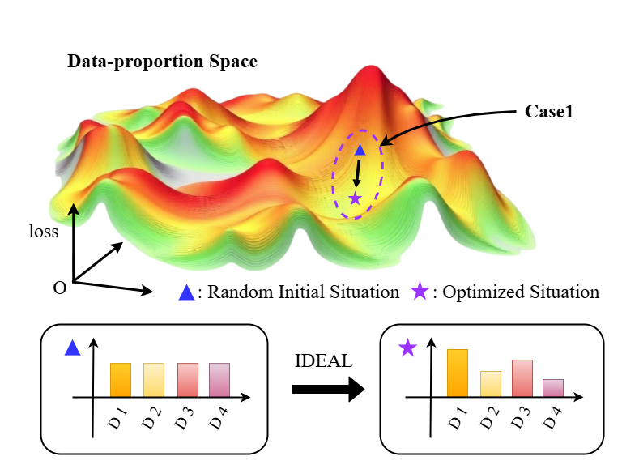
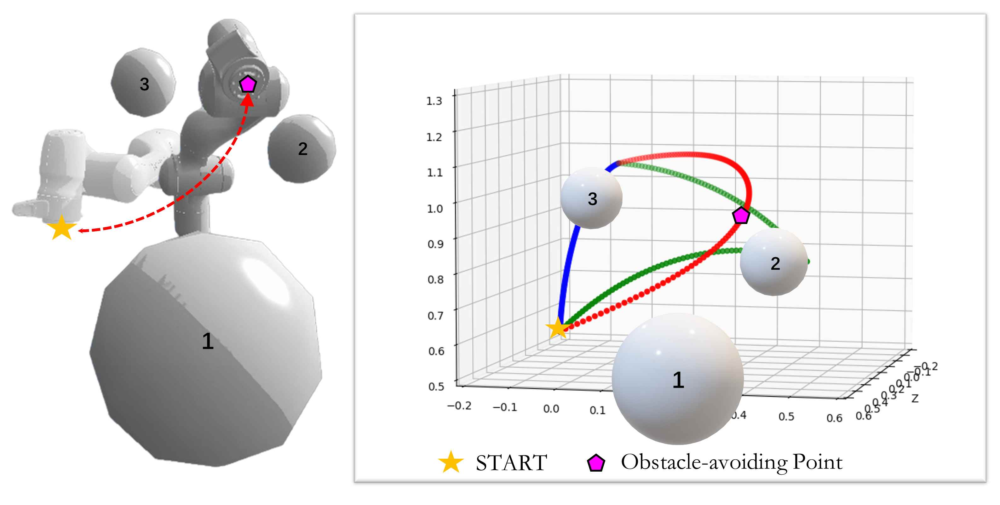
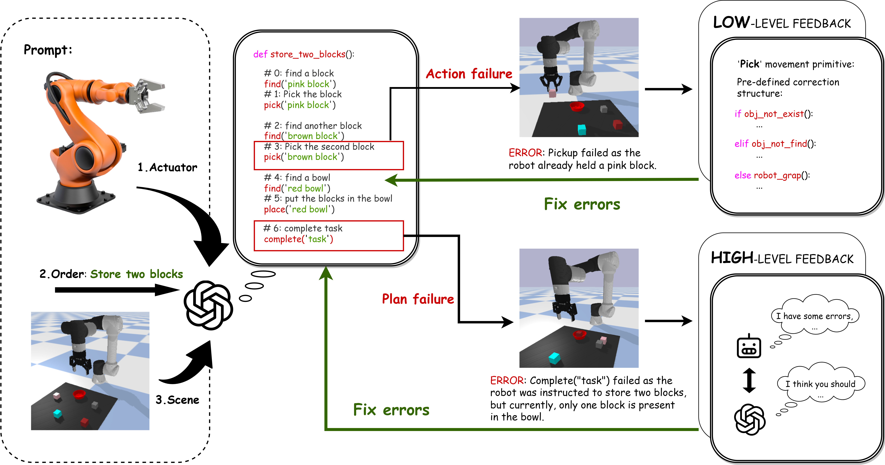
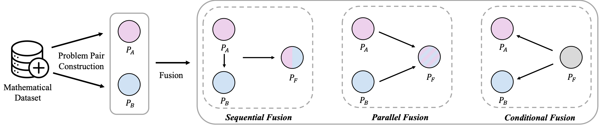
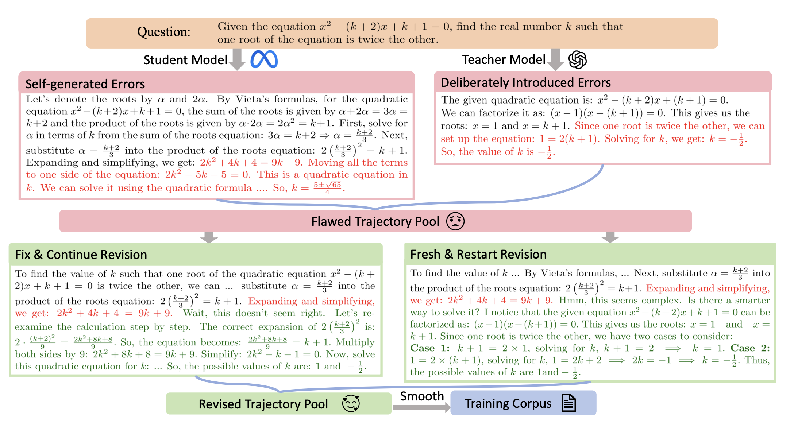
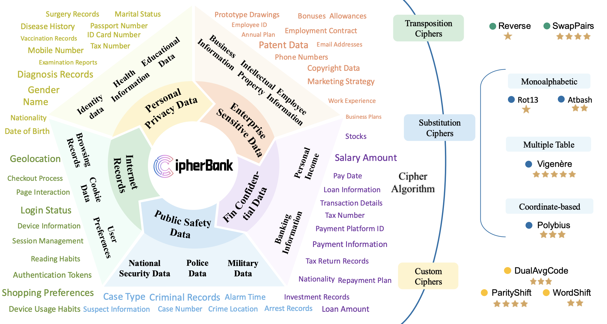

 

    
  

  

    ICLR 2026
    
IDEAL: Data Equilibrium Adaptation for Multi-Capability Language Model Alignment

    
Chenlin Ming, Chendi Qu, Xiaoming Duan, Qizhi Pei, Zhuoshi Pan, Yu Li, Conghui He, Lijun Wu

    

      <a class="pub-btn" href="https://arxiv.org/abs/2505.12762" target="_blank" rel="noopener">arXiv</a>
      <a class="pub-btn" href="https://github.com/ming-bot/IDEAL" target="_blank" rel="noopener">Code</a>
    

  

  

    
  

  

    RA-L 2025
    
Stochastic Trajectory Optimization for Robotic Skill Acquisition From a Suboptimal Demonstration

    
Chenlin Ming, Zitong Wang, Boxuan Zhang, Zhanxiang Cao, Xiaoming Duan, Jianping He

    

      <a class="pub-btn" href="https://ieeexplore.ieee.org/document/10976394/" target="_blank" rel="noopener">IEEE</a>
      <a class="pub-btn" href="https://github.com/ming-bot/MSTOMP" target="_blank" rel="noopener">Code</a>
    

  

  

    
  

  

    CAC 2024
    
HiCRISP: An LLM-Based Hierarchical Closed-Loop Robotic Intelligent Self-Correction Planner

    
Chenlin Ming, Jiacheng lin, Pangkit Fong, Han Wang, Xiaoming Duan, Jianping He

    

      <a class="pub-btn" href="https://ieeexplore.ieee.org/abstract/document/10865457/" target="_blank" rel="noopener">IEEE</a>
      <a class="pub-btn" href="https://github.com/ming-bot/HiCRISP" target="_blank" rel="noopener">Code</a>
    

  

  

    
  

  

    ACL 2025
    
MathFusion: Enhancing mathematic problem-solving of LLM through instruction fusion

    
Qizhi, Pei, Lijun Wu, Zhuoshi Pan, Yu Li, Honglin lin, Chenlin Ming, Xin Gao, Conghui He, Rui Yan

    

      <a class="pub-btn" href="https://aclanthology.org/2025.acl-long.367.pdf" target="_blank" rel="noopener">ACL</a>
    

  

  

    
  

  

    ACL 2025(Findings)
    
LEMMA: Learning from Errors for MatheMatical Advancement in LLMs

    
Zhuoshi Pan, Yu Li, Honglin lin, Qizhi Pei, Zinan Tang, Wei Wu, Chenlin Ming, H. Vicky Zhao, Conghui He, Lijun Wu

    

      <a class="pub-btn" href="https://aclanthology.org/2025.findings-acl.605.pdf" target="_blank" rel="noopener">ACL</a>
    

  

  

    
  

  

    ACL 2025(Findings)
    
CipherBank: Exploring the Boundary of LLM Reasoning Capabilities through Cryptography Challenges

    
Yu Li, Qizhi Pei, Mengyuan Sun, Honglin lin, Chenlin Ming, Xin Gao, Jiang Wu, Conghui He, Lijun Wu

    

      <a class="pub-btn" href="https://aclanthology.org/2025.findings-acl.309.pdf" target="_blank" rel="noopener">ACL</a>
    

  

<!-- 

  

    
  

  

    ICML 2024
    
Detecting and Identifying Selection Structure in Sequential Data

    
Yujia Zheng, Zeyu Tang, Yiwen Qiu, Bernhard Schölkopf, Kun Zhang

    

      <a class="pub-btn" href="https://arxiv.org/pdf/2407.00529" target="_blank" rel="noopener">arXiv</a>
    

  

  

    IEEE L-CSS 2023
    
Data-Driven Predictive Control Using Closed-Loop Data: An Instrumental Variable Approach

    
Yibo Wang, Yiwen Qiu, Malika Sader, Dexian Huang, Chao Shang

    

      <a class="pub-btn" href="https://arxiv.org/pdf/2309.05916" target="_blank" rel="noopener">arXiv</a>
    

  

  

    
  

  

    CoRL 2022
    
Out-of-Dynamics Imitation Learning from Multimodal Demonstrations

    
Yiwen Qiu, Jialong Wu, Zhangjie Cao, Mingsheng Long

    

      <a class="pub-btn" href="https://openreview.net/forum?id=X6CjiTWVRVr" target="_blank" rel="noopener">OpenReview</a>
      <a class="pub-btn" href="https://arxiv.org/abs/2211.06839v1" target="_blank" rel="noopener">arXiv</a>
    

  

  

    
  

  

    NeurIPS 2022 · Spotlight
    
When to Trust Your Simulator: Dynamics-Aware Hybrid Offline-and-Online Reinforcement Learning

    
Haoyi Niu, Shubham Sharma, Yiwen Qiu, Ming Li, Guyue Zhou, Jianming Hu, Xianyuan Zhan

    

      <a class="pub-btn" href="https://arxiv.org/abs/2206.13464v1" target="_blank" rel="noopener">arXiv</a>
    

  

 -->